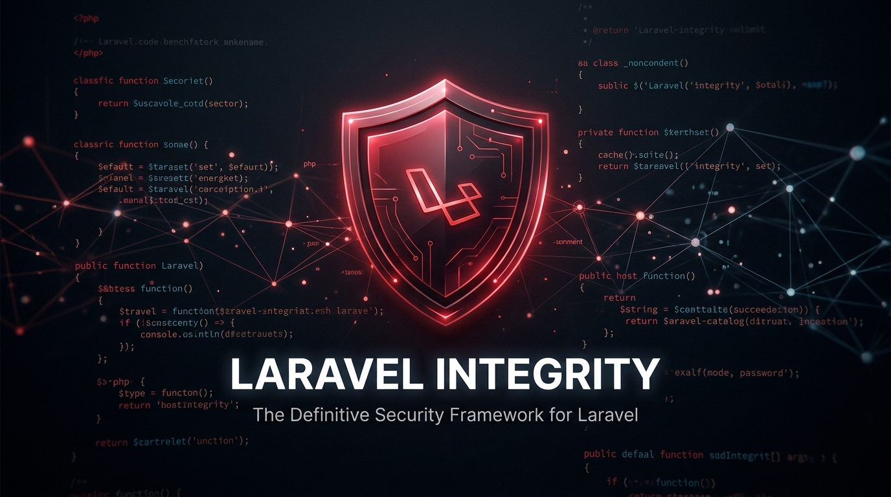

# Laravel-Integrity: Post-Deploy Code Integrity Checks



[](https://packagist.org/packages/clcbws/laravel-integrity)
[](https://packagist.org/packages/clcbws/laravel-integrity)
[](LICENSE.md)

High-Fidelity Static AST & Container Reflection Integrity Suite for Laravel & Livewire (Laravel 11.x / 12.x / 13.x | PHP 8.2+).

Zero Runtime Production Overhead.

---

## Documentation

For detailed configurations, lists of checks, and architectural references, visit our [official documentation](https://ahtesham-clcbws.github.io/laravel-integrity/):
- **[Architecture & Splicing Deep-Dive](https://ahtesham-clcbws.github.io/laravel-integrity/architecture)**
- **[Full Checks Reference Guide](https://ahtesham-clcbws.github.io/laravel-integrity/checks-reference)**
- **[CLI Configuration & Troubleshooting](https://ahtesham-clcbws.github.io/laravel-integrity/cli-troubleshooting)**
- **[Composer Hooks Integration](https://ahtesham-clcbws.github.io/laravel-integrity/composer-hooks)**

---

## Features

1. **Module Residue Cleanup**: Identifies orphaned views, dangling controller actions, dead service providers, and unlinked seeders.
2. **Template & Livewire Integrity**: Audits Blade templates and Livewire component views for named route existence, correct `<livewire:alias />` resolution, public action methods, and public model binding property visibilities.
3. **Import & Type Hygiene (with `--fix`)**: Enforces strict types (`declare(strict_types=1);`), repairs inline root namespace facade calls (e.g. `\DB::` -> `DB::`), and cleans up unused imports.
4. **Post-Deploy Pre-Flight checks**: Checks for closure routes (which prevents serialization under `route:cache`), unapplied database migrations, syntax errors in Blade templates, and Eloquent models mapping to missing database tables.

---

## Installation

You can install the package via Composer (view on [Packagist](https://packagist.org/packages/clcbws/laravel-integrity)):

```bash
composer require clcbws/laravel-integrity --dev
```

Publish the default configuration file:

```bash
php artisan vendor:publish --tag=integrity-config
```

---

## Usage

### 1. Audit Check Pipeline
Run all lightweight, static checks across the configured directories:

```bash
php artisan integrity:check
```

Include database connections and full Blade compilation checks:

```bash
php artisan integrity:check --full
```

Fail with a non-zero exit code if any issues are identified (ideal for CI pipelines):

```bash
php artisan integrity:check --strict
```

Scan only Git staged/modified files (ideal for pre-commit hooks):

```bash
php artisan integrity:check --dirty
```

Filter by check category:

```bash
php artisan integrity:check --only=hygiene,livewire
```

---

## Auto-Remediation

Automatically fix strict types, root facade references, and unused imports:

```bash
php artisan integrity:fix
```

Fix staged files only:

```bash
php artisan integrity:fix --dirty
```

---

## Baseline Management

Snapshot existing codebase issues into `.integrity-baseline.json` to ignore them on subsequent check runs:

```bash
php artisan integrity:baseline
```

---

## License

The MIT License (MIT). Please see [License File](LICENSE.md) for more information.
