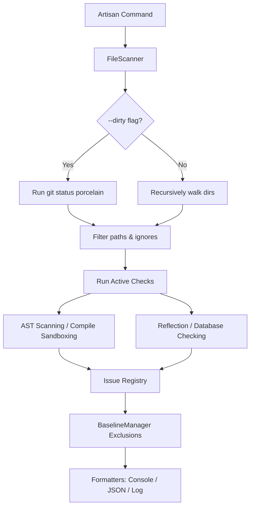

# Architecture & Deep-Dive

This document details the internal design, scanning flow, and AST splicing algorithms of the `clcbws/laravel-integrity` package.

---

## High-Level Execution Pipeline

The execution flow of the check engine runs as follows:

---

## 1. Static AST Parsing (`AstParserEngine`)

To scan code formatting rules, facade imports, and direct environment dependencies:
- **Agility**: Uses `nikic/php-parser` v5 configured to use the running host PHP version (`ParserFactory::createForHostVersion()`).
- **Optimization**: Resolves namespaces and names during traversal via `PhpParser\NodeVisitor\NameResolver`.
- **Node Analysis**: Leverages node attributes (`startFilePos`, `endFilePos`) to fetch exact byte boundaries within raw files.

---

## 2. Option B Splicing Fixer Algorithm

All fixers (`StrictTypesFixer`, `FacadeImportFixer`, `UnusedImportFixer`) modify code files without formatting corruption by using byte-offset splicing.

### Index Shifting Mitigation
When modifying file contents, adding or deleting text changes byte offsets for all subsequent characters. To prevent indexing drift:
1. All issues identified by a check are grouped by file.
2. The issues are sorted by their byte-level `start_pos` in **descending order** (bottom-to-top / right-to-left).
3. Modifications are applied sequentially from bottom-to-top so that indices of subsequent modifications are preserved.
4. The modified content is written to a `.tmp` file, validated using `php -l`, and renamed atomically.

---

## 3. Blade & Livewire Integration

- **`BladeTokenScanner`**: Converts Blade markup files to PHP strings using Laravel's native compiling mechanisms (`Blade::compileString()`), then parses the generated PHP statements to search for `route()` and `@include` calls.
- **`LivewireComponentMapper`**: Dynamically maps Blade views to their backing PHP component classes by:
  - Performing convention casing lookups.
  - Scanning components for returned view names in their `render()` methods using AST parser visitors.
